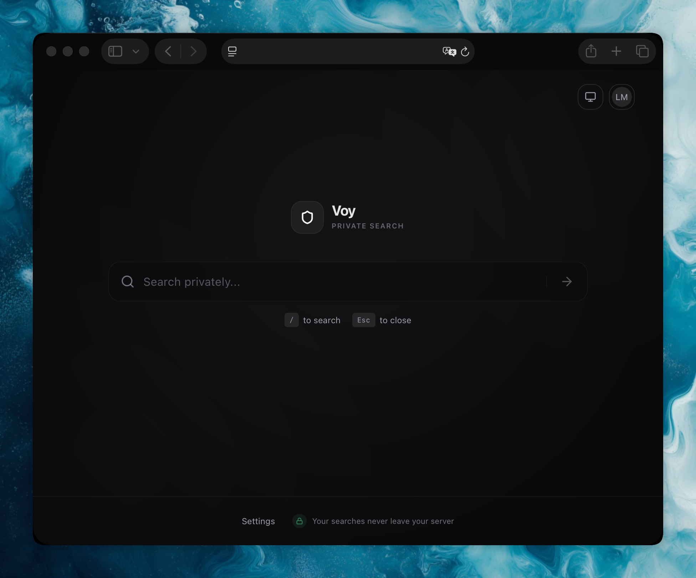

# Voy

[](https://opensource.org/licenses/MIT)
[](https://bun.sh)
[](https://github.com/leomartindev/voy/actions/workflows/ci.yml)
[](https://github.com/leomartindev/voy/actions/workflows/docker-build-push.yml)

A self-hosted, privacy-first metasearch engine built on top of [SearXNG](https://searxng.github.io/searxng/). All searches are proxied through your own server — no tracking, no data sent to third parties.



## Features

- **Private search** — queries never leave your server, aggregated from multiple search engines via SearXNG
- **Web, Image & File search** — switch between result categories with tab-based filters
- **AI Summaries** (optional) — streaming AI-generated summaries of top results powered by Mistral, with inline citations
- **Autocomplete** — real-time search suggestions as you type
- **Authentication** — email/password login with admin and user roles
- **Per-user settings** — theme (light/dark/system), safe search level, link behavior, AI toggle
- **OpenSearch support** — add Voy as a search provider in your browser
- **Keyboard shortcuts** — `/` to focus search, `Esc` to clear
- **First-run setup wizard** — guided configuration on first launch

## Tech Stack

**Frontend:** React 19, TanStack Start/Router/Query, Tailwind CSS v4, shadcn/ui, Radix UI

**Backend:** Bun, TanStack Start server functions, Better Auth, Drizzle ORM, SQLite

**Infrastructure:** SearXNG, Valkey (Redis-compatible), Docker

## Quick Start

### Prerequisites

- [Docker](https://docs.docker.com/get-docker/) and [Docker Compose](https://docs.docker.com/compose/install/)

### 1. Clone the repository

```bash
git clone https://github.com/LeoMartinDev/voy.git
cd voy
```

### 2. Create a `.env` file

```bash
cp .env.example .env
```

Or create one manually:

```env
BETTER_AUTH_SECRET=your-secret-key-here
SEARXNG_SECRET=your-searxng-secret-here
INSTANCE_NAME=Voy
SITE_URL=http://localhost:3000
```

> Generate secure secrets with `openssl rand -base64 32`

### 3. Start the application

**Production** (uses pre-built image from GHCR):

```bash
docker compose -f compose.yml up -d
```

**Development** (builds from source with hot reload):

```bash
docker compose up
```

### 4. Open the app

Navigate to [http://localhost:3000](http://localhost:3000). On first launch, the setup wizard will guide you through configuring safe search and creating your admin account.

### 5. Setup as default search engine

To set Voy as your default search engine in your browser:

1. Open your browser settings
2. Find the "Search" or "Search engine" settings
3. Add a new search engine with the following details:
   - Name: Your instance name (e.g. "Voy")
   - URL: `SITE_URL/search?q=%s` (e.g. `https://myapp.com/search?q=%s`)

## Configuration

### Environment Variables

| Variable             | Required | Default  | Description                    |
| -------------------- | -------- | -------- | ------------------------------ |
| `BETTER_AUTH_SECRET` | Yes      | —        | Secret key for session signing |
| `SITE_URL`           | Yes      | —        | Public URL of the app          |
| `SEARXNG_SECRET`     | Yes      | —        | Secret key for SearXNG         |
| `INSTANCE_NAME`      | No       | `Voy`    | Display name shown in the UI   |
| `DATABASE_URL`       | No       | `dev.db` | SQLite database file path      |
| `PORT`               | No       | `3000`   | HTTP server port               |

### AI Summaries (Optional)

To enable AI-powered search summaries:

1. Get a [Mistral API key](https://console.mistral.ai/)
2. Log in as admin and go to **Settings > Server**
3. Enter your Mistral API key
4. Users can individually toggle AI summaries in **Settings > AI**

## API

Voy provides a REST API for programmatically accessing search results.

### Authentication

API access requires an API key, which must be included in the query parameters as `key`.
Only administrators can generate API keys via **Settings > API Keys**.

**Example:**

```bash
curl "http://localhost:3000/api/search?q=test&key=voy_a1b2c3d4..."
```

### Endpoints

| Endpoint       | Method | Auth Required | Description                        |
| -------------- | ------ | ------------- | ---------------------------------- |
| `/api/search`  | GET    | Yes           | Search results (Web, Images, etc.) |
| `/api/suggest` | GET    | No            | Autocomplete suggestions           |
| `/api/health`  | GET    | No            | System health check                |

#### Search Parameters (`/api/search`)

- `q` (required): Search query
- `key` (required): API key
- `category`: `web` (default), `images`, `videos`, `news`, `files`
- `timeRange`: `day`, `month`, `year`
- `safeSearch`: `strict`, `moderate`, `off`
- `locale`: Language code (e.g., `en-US`)

## Development

### Prerequisites

- [Bun](https://bun.sh) (v1+)
- [Docker](https://docs.docker.com/get-docker/) (for SearXNG and Valkey)

### Local Development with Docker

The easiest way to develop is with Docker Compose, which sets up everything including SearXNG and Valkey:

```bash
docker compose up
```

This mounts the source code and enables hot reload.

### Available Scripts

```bash
bun install          # Install dependencies
bun dev              # Start dev server (requires SearXNG running)
bun test             # Run tests
bun check            # Lint and format check (Biome)
bun run build        # Production build

# Database
bun db:generate      # Generate migrations after schema changes
bun db:migrate       # Apply pending migrations
bun db:studio        # Open Drizzle Studio GUI
bun db:reset         # Reset database (destructive)
```

## Architecture

The server follows **Clean Architecture** with three layers:

```
src/server/
├── domain/          # Ports (interfaces) and value objects — no external dependencies
├── application/     # Use cases and services — orchestrates domain logic
└── infrastructure/  # Adapters — SearXNG, Mistral, Drizzle, Better Auth
```

All layers are wired via a lazy singleton DI container (`src/server/container.ts`).

## Docker

The production image is a multi-stage build:

1. **base** — install locked dependencies
2. **dev** — development image with hot reload
3. **builder** — generates migrations and builds the app
4. **runner** — minimal production image, runs as non-root user

The image is automatically built and pushed to `ghcr.io/LeoMartinDev/voy:latest` on every push to `main`.

### Services

| Service     | Description                        |
| ----------- | ---------------------------------- |
| **app**     | The Voy application (port 3000)    |
| **searxng** | SearXNG metasearch backend         |
| **valkey**  | Redis-compatible cache for SearXNG |

## Roadmap

- [ ] Mobile app (PWA)
- [ ] Browser extension for easier search integration
- [ ] More AI providers (OpenAI, Anthropic, Ollama)
- [ ] Customizable search engines and weighting
- [ ] Multi-user support with different permissions

## Contributing

Contributions are welcome. Please read [CONTRIBUTING.md](CONTRIBUTING.md) before submitting a pull request.

1. Fork the repository
2. Create a feature branch (`git checkout -b feature/my-feature`)
3. Commit your changes (`git commit -m 'Add my feature'`)
4. Push to the branch (`git push origin feature/my-feature`)
5. Open a Pull Request

## License

This project is licensed under the [MIT License](LICENSE.md).
