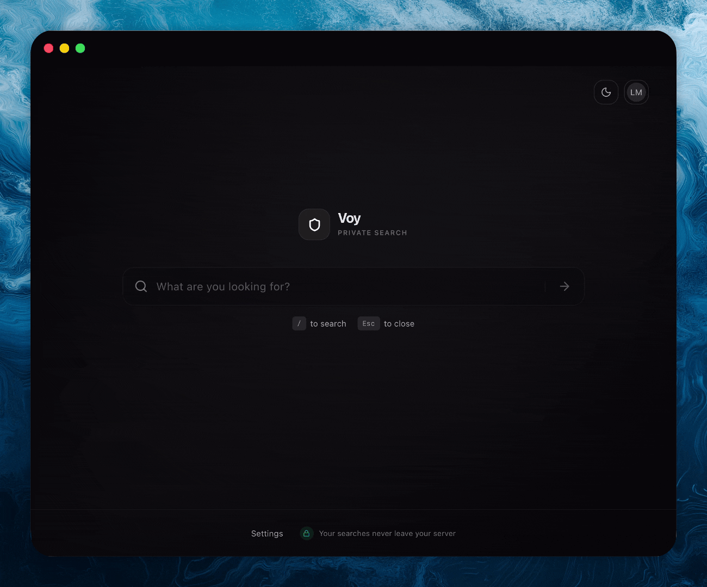

# Voy

[](https://opensource.org/licenses/MIT)
[](https://bun.sh)
[](https://github.com/leomartindev/voy/actions/workflows/ci.yml)
[](https://github.com/leomartindev/voy/actions/workflows/docker-build-push.yml)

A self-hosted, privacy-first metasearch engine built on top of [SearXNG](https://searxng.github.io/searxng/). All searches are proxied through your own server — no tracking, no data sent to third parties.



## Features

- **Private search** — queries never leave your server, aggregated from multiple search engines via SearXNG
- **Web, Image & File search** — switch between result categories with tab-based filters
- **Autocomplete** — real-time search suggestions as you type
- **Authentication** — email/password login with admin and user roles
- **Per-user settings** — theme (light/dark/system), safe search level, link behavior, AI toggle
- **OpenSearch support** — add Voy as a search provider in your browser
- **Keyboard shortcuts** — `/` to focus search, `Esc` to clear
- **First-run setup wizard** — guided configuration on first launch

## Tech Stack

**Frontend:** React 19, TanStack Start/Router/Query, Tailwind CSS v4, shadcn/ui, Radix UI

**Backend:** Bun, TanStack Start server functions, Better Auth, Drizzle ORM, SQLite

**Infrastructure:** SearXNG, Valkey (Redis-compatible), Docker

## Deployment

Deploy Voy on any server without cloning the repository — the image is pulled directly from GHCR.

### Prerequisites

- [Docker](https://docs.docker.com/get-docker/) and [Docker Compose](https://docs.docker.com/compose/install/)

### 1. Create a `compose.yml`

```yaml
services:
  app:
    image: ghcr.io/leomartindev/voy:latest
    restart: unless-stopped
    environment:
      # Port for the application (default: 3000)
      PORT: ${PORT:-3000}
      BUN_ENV: production
      DATABASE_URL: /data/app.db
      SEARXNG_URL: http://searxng:8080
      BETTER_AUTH_SECRET: ${BETTER_AUTH_SECRET}
      INSTANCE_NAME: ${INSTANCE_NAME}
      SITE_URL: ${SITE_URL}
    volumes:
      - app-data:/data
    ports:
      - "${PORT:-3000}:${PORT:-3000}"
    depends_on:
      searxng:
        condition: service_healthy
    networks:
      - searchengine-network

  valkey:
    image: valkey/valkey:8-alpine
    restart: unless-stopped
    command: valkey-server --save 30 1 --loglevel warning
    volumes:
      - valkey-data:/data
    healthcheck:
      test: ["CMD", "valkey-cli", "ping"]
      interval: 5s
      timeout: 5s
      retries: 5
    networks:
      - searchengine-network

  searxng:
    image: searxng/searxng:latest
    restart: unless-stopped
    environment:
      SEARXNG_SECRET: ${SEARXNG_SECRET}
      UWSGI_WORKERS: 2
      UWSGI_THREADS: 2
      UWSGI_ENABLE_THREADS: true
    volumes:
      - searxng-data:/var/cache/searxng
    depends_on:
      valkey:
        condition: service_healthy
    healthcheck:
      test: ["CMD", "wget", "-q", "--spider", "http://localhost:8080/healthz"]
      interval: 10s
      timeout: 5s
      retries: 5
    networks:
      - searchengine-network

configs:
  searxng_settings:
    content: |
      use_default_settings: true

      server:
        secret_key: ${SEARXNG_SECRET}
        image_proxy: false
        limiter: false
        public_instance: false
        max_results: 20

      engines:
        - name: yahoo
          disabled: true

      search:
        autocomplete: duckduckgo
        autocomplete_min: 3
        max_page: 1
        formats:
          - json
        categories:
          - general
          - images
          - files

      outgoing:
        max_request_timeout: 1.8

      enabled_plugins: []

      valkey:
        url: valkey://valkey:6379/0

volumes:
  app-data:
  valkey-data:
  searxng-data:

networks:
  searchengine-network:
    driver: bridge
```

### 2. Create a `.env` file

```env
BETTER_AUTH_SECRET=your-secret-key-here
SEARXNG_SECRET=your-searxng-secret-here
INSTANCE_NAME=Voy
SITE_URL=https://your-domain.com
```

> Generate secure secrets with `openssl rand -base64 32`

### 3. Start

```bash
docker compose up -d
```

Navigate to your `SITE_URL`. On first launch, the setup wizard will guide you through configuring safe search and creating your admin account.

### 4. Set as default search engine

1. Open your browser settings and find "Search engine"
2. Add a new search engine:
   - Name: your instance name (e.g. "Voy")
   - URL: `https://your-domain.com/search?q=%s`

## Configuration

### Environment Variables

| Variable             | Required | Default  | Description                    |
| -------------------- | -------- | -------- | ------------------------------ |
| `BETTER_AUTH_SECRET` | Yes      | —        | Secret key for session signing |
| `SITE_URL`           | Yes      | —        | Public URL of the app          |
| `SEARXNG_SECRET`     | Yes      | —        | Secret key for SearXNG         |
| `INSTANCE_NAME`      | No       | `Voy`    | Display name shown in the UI   |
| `DATABASE_URL`       | No       | `dev.db` | SQLite database file path      |
| `PORT`               | No       | `3000`   | HTTP server port               |

## API

Voy provides a REST API for programmatically accessing search results.

### Authentication

API access requires an API key, which must be included in the query parameters as `key`.
Only administrators can generate API keys via **Settings > API Keys**.

**Example:**

```bash
curl "http://localhost:3000/api/search?q=test&key=voy_a1b2c3d4..."
```

### Endpoints

| Endpoint       | Method | Auth Required | Description                        |
| -------------- | ------ | ------------- | ---------------------------------- |
| `/api/search`  | GET    | Yes           | Search results (Web, Images, etc.) |
| `/api/suggest` | GET    | No            | Autocomplete suggestions           |
| `/api/health`  | GET    | No            | System health check                |

#### Search Parameters (`/api/search`)

- `q` (required): Search query
- `key` (required): API key
- `category`: `web` (default), `images`, `videos`, `news`, `files`
- `timeRange`: `day`, `month`, `year`
- `safeSearch`: `strict`, `moderate`, `off`
- `locale`: Language code (e.g., `en-US`)

## Development

### Prerequisites

- [Bun](https://bun.sh) (v1+)
- [Docker](https://docs.docker.com/get-docker/) (for SearXNG and Valkey)

### Setup

```bash
git clone https://github.com/LeoMartinDev/voy.git
cd voy
cp .env.example .env
docker compose up
```

This starts SearXNG and Valkey, mounts the source code, and enables hot reload. Open [http://localhost:3000](http://localhost:3000).

### Available Scripts

```bash
bun install          # Install dependencies
bun dev              # Start dev server (requires SearXNG running)
bun test             # Run tests
bun check            # Lint and format check (Biome)
bun run build        # Production build

# Database
bun db:generate      # Generate migrations after schema changes
bun db:migrate       # Apply pending migrations
bun db:studio        # Open Drizzle Studio GUI
bun db:reset         # Reset database (destructive)
```

## Architecture

The server follows **Clean Architecture** with three layers:

```
src/server/
├── domain/          # Ports (interfaces) and value objects — no external dependencies
├── application/     # Use cases and services — orchestrates domain logic
└── infrastructure/  # Adapters — SearXNG, Mistral, Drizzle, Better Auth
```

All layers are wired via a lazy singleton DI container (`src/server/container.ts`).

## Docker

The production image is a multi-stage build:

1. **base** — install locked dependencies
2. **builder** — generates migrations and builds the app
3. **runner** — minimal production image, runs as non-root user

The image is automatically built and pushed to `ghcr.io/LeoMartinDev/voy:latest` on every push to `main`.

## Contributing

Contributions are welcome. Please read [CONTRIBUTING.md](CONTRIBUTING.md) before submitting a pull request.

1. Fork the repository
2. Create a feature branch (`git checkout -b feature/my-feature`)
3. Commit your changes (`git commit -m 'Add my feature'`)
4. Push to the branch (`git push origin feature/my-feature`)
5. Open a Pull Request

## License

This project is licensed under the [MIT License](LICENSE.md).
